# Radio Calico System Architecture

This document provides comprehensive architecture diagrams for Radio Calico using Mermaid.

## Table of Contents
1. [Overall System Architecture](#overall-system-architecture)
2. [Production Deployment](#production-deployment)
3. [Development Architecture](#development-architecture)
4. [Data Flow](#data-flow)
5. [CI/CD Pipeline](#cicd-pipeline)
6. [Database Schema](#database-schema)

---

## Overall System Architecture


---

## Production Deployment

```mermaid
graph TB
    subgraph "External Access"
        User[User Browser<br/>http://localhost]
        StreamProvider[Streaming Service<br/>Radio.co/Mixlr/AWS]
    end

    subgraph "Docker Host - Production"
        subgraph "Port Mapping"
            Port80[":80 → :80"]
        end

        subgraph "nginx Container"
            NGINX[nginx 1.25-alpine<br/>11 MB RAM]
            NginxConf[nginx.conf<br/>default.conf]
            NginxLogs[/var/log/nginx]
        end

        subgraph "Application Container"
            NodeApp[Node.js 18-alpine<br/>19 MB RAM]
            ServerJS[server.js<br/>Express App]
            Routes[API Routes<br/>users, ratings, health]
        end

        subgraph "Database Container"
            PG[PostgreSQL 15-alpine<br/>40 MB RAM]
            PGData[/var/lib/postgresql/data]
        end

        subgraph "Docker Volumes"
            V1[(postgres-data)]
            V2[(nginx-logs)]
        end

        subgraph "Docker Network"
            Bridge[radio-calico-network<br/>Bridge Driver]
        end
    end

    User -->|HTTP Request| Port80
    Port80 --> NGINX
    NGINX -->|/api/*| NodeApp
    NGINX -->|/*.html,css,js| Static[Static Files<br/>public/]
    NGINX --> NginxLogs

    NodeApp --> ServerJS
    ServerJS --> Routes
    Routes -->|SQL Queries| PG

    PG --> PGData
    PGData --> V1
    NginxLogs --> V2

    NGINX -.->|Internal| Bridge
    NodeApp -.->|Internal| Bridge
    PG -.->|Internal| Bridge

    NodeApp -->|Fetch Stream| StreamProvider
    User -->|Direct HLS| StreamProvider

    style User fill:#e1f5ff
    style NGINX fill:#90EE90
    style NodeApp fill:#FFD700
    style PG fill:#4169E1,color:#fff
    style V1 fill:#DDA0DD
    style V2 fill:#DDA0DD
```

---

## Development Architecture


---

## Data Flow


---

## CI/CD Pipeline


---

## Database Schema


**Indexes:**
- `idx_ratings_song_id` on `ratings(song_id)` for fast song lookups
- `UNIQUE(song_id, user_id)` prevents duplicate votes

**Notes:**
- Users table is legacy (demo feature)
- Ratings table is primary feature for song voting
- song_id is Base64 encoded: `btoa(artist + '::' + title)`
- user_id stored in browser localStorage, not FK to users table

---

## Component Interaction Map


---

## Security Architecture


---

## Make Targets Overview


---

## File Structure Tree

```
radiocalico/
├── .github/
│   ├── workflows/
│   │   ├── ci.yml                    # Main CI pipeline
│   │   ├── security-scan.yml         # Weekly security
│   │   └── README.md                 # Workflow docs
│   └── dependabot.yml                # Dependency automation
│
├── nginx/
│   ├── nginx.conf                    # Main nginx config
│   └── default.conf                  # Site config + CSP
│
├── public/
│   ├── index.html                    # HTML structure (149 lines)
│   ├── radio-calico.css              # Styling (875 lines)
│   ├── radio-calico.js               # Main logic (503 lines)
│   └── radio-calico-utils.js         # Testable utils
│
├── server.js                         # Express server
├── database.js                       # SQLite implementation
├── database-postgres.js              # PostgreSQL implementation
├── database-config.js                # DB abstraction layer
│
├── server.test.js                    # Backend tests (25)
├── frontend.test.js                  # Frontend tests (38)
├── test-helpers.js                   # Test utilities
│
├── security-scan.sh                  # Security scanner
├── Makefile                          # Linux/Mac commands
├── make.bat                          # Windows commands
│
├── Dockerfile                        # Multi-stage build
├── docker-compose.yml                # Development
├── docker-compose.prod.yml           # Production
├── docker-dev.sh                     # Dev helper
├── docker-prod.sh                    # Prod helper
│
├── .env.production                   # Prod environment vars
├── package.json                      # Dependencies
├── package-lock.json                 # Locked versions
│
├── README.md                         # Main documentation
├── CLAUDE.md                         # Project guide
├── ARCHITECTURE.md                   # This file
└── .gitignore                        # Git exclusions
```

---

## Technology Stack

```mermaid
mindmap
  root((Radio Calico))
    Frontend
      HTML5
      CSS3
        Animations
        Flexbox/Grid
      Vanilla JavaScript
      HLS.js
      Web Audio API
    Backend
      Node.js 18
      Express.js 4
      SQLite3
      PostgreSQL 15
    DevOps
      Docker
        Multi-stage builds
        Alpine Linux
      Docker Compose
      nginx 1.25
    Testing
      Jest
      Supertest
      63 Unit Tests
    CI/CD
      GitHub Actions
      Dependabot
      npm audit
    Tools
      Makefile
      Bash scripts
      Git
```



---

## Deployment Options


---

## Summary

Radio Calico is a **production-ready streaming radio application** with:

- **Modern Architecture**: Microservices in Docker containers
- **Robust Testing**: 63 automated tests with CI/CD
- **Security First**: CSP, rate limiting, automated audits
- **Developer Friendly**: Make targets, hot-reload, comprehensive docs
- **Scalable**: PostgreSQL, nginx, container orchestration
- **Maintainable**: Clean separation of concerns, well-documented

Total Lines of Code:
- Frontend: ~1,530 lines (HTML/CSS/JS)
- Backend: ~600 lines (Node.js/Express)
- Tests: ~800 lines (Jest/Supertest)
- DevOps: ~1,000 lines (Docker/CI/nginx)
- **Total: ~4,000 lines** of production code

Built with ❤️ using Claude Code
